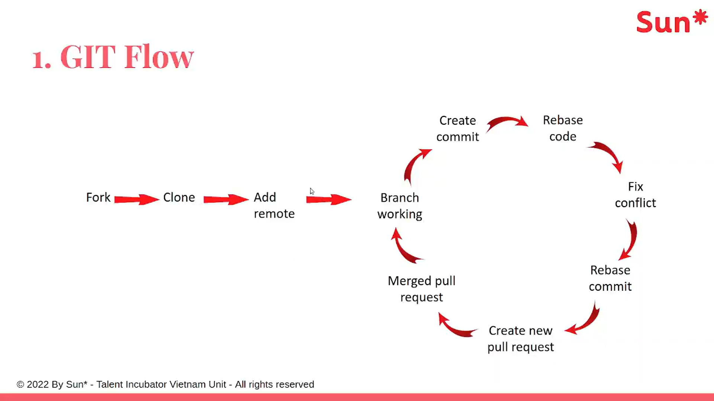

## Git Introduction (Giới thiệu về Git)

**Git là gì?**
Git là một Hệ thống Quản lý Phiên bản Phân tán (Distributed Version Control System - DVCS). Nó được thiết kế để theo dõi sự thay đổi trong các tệp tin (thường là mã nguồn) và điều phối công việc giữa nhiều người lập trình cùng làm việc trên một dự án.

**Đặc điểm cốt lõi:**

* **Phân tán (Distributed):** Mỗi lập trình viên không chỉ có một bản sao của mã nguồn hiện tại mà còn có toàn bộ lịch sử thay đổi (repository) ngay trên máy cá nhân của họ. Dù máy chủ có sập, bất kỳ bản sao nào ở máy cá nhân cũng có thể dùng để khôi phục.
* **Snapshot, không phải Difference:** Khác với các hệ thống cũ lưu trữ sự thay đổi của từng dòng code, Git coi dữ liệu giống như một tập hợp các "ảnh chụp nhanh" (snapshots). Mỗi lần   lưu trữ (commit), Git sẽ chụp lại toàn bộ trạng thái hệ thống tệp tại thời điểm đó.
* **Các trạng thái chính của Git:**
* **Working Directory (Thư mục làm việc):** Nơi   trực tiếp chỉnh sửa các tệp tin.
* **Staging Area (Vùng chờ):** Nơi chứa các tệp tin đã được đánh dấu để chuẩn bị lưu vào lịch sử ở lần commit tiếp theo.
* **Git Directory / Repository (Kho lưu trữ):** Nơi Git lưu trữ siêu dữ liệu và cơ sở dữ liệu đối tượng (lịch sử commit).


---

## Git Basic (Các thao tác cơ bản)

Đây là quy trình làm việc và các lệnh   sẽ sử dụng hàng ngày:

* **Khởi tạo kho lưu trữ mới:**
`git init` (Biến một thư mục bình thường thành một Git repository).
* **Sao chép kho lưu trữ có sẵn:**
`git clone <url>` (Tải toàn bộ source code và lịch sử từ server như GitHub/GitLab về máy).
* **Kiểm tra trạng thái:**
`git status` (Xem tệp nào bị thay đổi, tệp nào đang ở Staging Area).
* **Thêm tệp vào Staging Area:**
`git add <tên-tệp>` hoặc `git add .` (Thêm tất cả các thay đổi).
* **Ghi lại thay đổi (Commit):**
`git commit -m "Tin nhắn mô tả thay đổi"` (Đóng gói các tệp trong Staging Area thành một snapshot lưu vào lịch sử).
* **Xem lịch sử thay đổi:**
`git log` (Liệt kê danh sách các commit trước đó).
* **Đẩy / Kéo code từ Server (Remote):**
* `git push`: Đẩy các commit từ máy tính của   lên server.
* `git pull`: Lấy code mới nhất từ server về và gộp vào code trên máy  .


---

## Branching (Nhánh)

**Nhánh là gì?**
Branching là khả năng rẽ nhánh để làm việc trên một tính năng mới, sửa lỗi, hoặc thử nghiệm mà không làm ảnh hưởng đến luồng code chính (thường gọi là nhánh `main` hoặc `master`).

Hãy tưởng tượng nhánh như một vũ trụ song song, nơi   có thể thoải mái code. Khi code hoàn thiện và chạy tốt,  mới đưa nó trở lại vũ trụ chính.

**Các lệnh cơ bản về nhánh:**

* **Tạo nhánh mới:** `git branch <tên-nhánh>`
* **Chuyển sang nhánh khác:** `git checkout <tên-nhánh>` hoặc lệnh mới hơn là `git switch <tên-nhánh>`
* **Vừa tạo vừa chuyển sang nhánh mới:** `git checkout -b <tên-nhánh>` hoặc `git switch -c <tên-nhánh>`
* **Xem danh sách các nhánh:** `git branch`
* **Xóa nhánh:** `git branch -d <tên-nhánh>`

---

## Git rebase & Git merge (Gộp nhánh)

Khi  làm việc xong trên một nhánh phụ và muốn đưa code vào nhánh chính,  có hai cách: **Merge** hoặc **Rebase**. Mặc dù mục đích cuối cùng giống nhau, nhưng cách Git xử lý lịch sử lại hoàn toàn khác biệt.

### Git Merge

* **Cách hoạt động:** Git sẽ lấy nhánh    và nhánh chính, tìm điểm chung gần nhất, và tạo ra một **Merge Commit** mới. Commit này kết nối lịch sử của cả hai nhánh lại với nhau.
* **Lệnh sử dụng:** Đang ở nhánh `main`, chạy `git merge <tên-nhánh-phụ>`.
* **Ưu điểm:** Tôn trọng hoàn toàn lịch sử gốc. Không có commit nào bị thay đổi hay phá hủy.  thấy rõ quá trình phân nhánh và gộp nhánh diễn ra khi nào.
* **Nhược điểm:** Nếu dự án có nhiều người làm và gộp liên tục, biểu đồ lịch sử (git tree) sẽ rất rối rắm, chằng chịt các đường nối và đầy các commit có nội dung *"Merge branch X into Y"*.

### Git Rebase

* **Cách hoạt động:** Thay vì tạo ra một commit gộp, Rebase sẽ "bứng" toàn bộ các commit mới của nhánh phụ và "đắp" chúng lên trên đỉnh của nhánh chính. Git làm điều này bằng cách tạo ra các *commit hoàn toàn mới* có nội dung y hệt các commit cũ.
* **Lệnh sử dụng:** Đang ở nhánh phụ, chạy `git rebase main`. (Sau đó về `main` chạy `git merge` để fast-forward).
* **Ưu điểm:** Tạo ra một lịch sử dự án là một đường thẳng tắp, sạch sẽ, không có các nhánh rẽ ngang rẽ dọc hay các merge commit dư thừa. Rất dễ để đọc lịch sử bằng `git log`.
* **Nhược điểm:** **Rebase viết lại lịch sử (Rewrite history).**
* **Nguyên tắc vàng của Rebase:** KHÔNG BAO GIỜ được rebase các nhánh public (nhánh đã push lên server mà người khác đang cùng sử dụng). Nếu   thay đổi lịch sử mà người khác đã tải về, nó sẽ gây ra sự hỗn loạn nghiêm trọng cho toàn đội. Chỉ dùng Rebase cho nhánh cá nhân (local branch) của   trước khi gộp vào nhánh chung.
### `git fetch` (Tải về nhưng "để đó nhìn")

**`git fetch`** sẽ kết nối với remote repository, tải toàn bộ các commit, file, và thông tin nhánh (branch) mới nhất về máy , nhưng nó **KHÔNG** làm thay đổi code trong thư mục  đang làm việc (working directory).

* **Đặc điểm:** Rất an toàn. Nó giống như việc  ra hòm thư lấy thư về để trên bàn, nhưng chưa mở ra đọc hay cất vào tủ hồ sơ.
* **Cách sử dụng:**
```bash
# Lấy toàn bộ thông tin mới từ remote (thường là 'origin')
git fetch origin

# Lấy thông tin mới từ một nhánh cụ thể
git fetch origin main

```


* **Sau khi fetch?** Có thể dùng lệnh `git log` hoặc `git diff` để so sánh xem trên remote có gì mới so với code hiện tại , trước khi quyết định gộp chúng vào.

### `git pull` (Tải về và "nhập vào luôn")

**`git pull`** thực chất là sự kết hợp của 2 lệnh: **`git fetch`** (tải dữ liệu về) và sau đó ngay lập tức chạy **`git merge`** (gộp dữ liệu đó vào nhánh  đang làm việc).

* **Đặc điểm:** Nhanh gọn và tiện lợi, nhưng có rủi ro. Nếu code trên remote và code ở máy cùng sửa trên một file, nó có thể gây ra **Conflict** (xung đột code), và  sẽ phải sửa lỗi xung đột này bằng tay.
* **Công thức:** `git pull` = `git fetch` + `git merge`
* **Cách sử dụng:**
```bash
# Tải và gộp code từ nhánh hiện tại trên remote vào nhánh hiện tại ở local
git pull

# Tải và gộp code từ nhánh 'main' trên remote 'origin'
git pull origin main

```


---

### Bảng so sánh nhanh

| Tiêu chí | `git fetch` | `git pull` |
| --- | --- | --- |
| **Bản chất** | Chỉ tải dữ liệu về máy | Tải dữ liệu về + Gộp vào code hiện tại |
| **Ảnh hưởng code** | Không thay đổi code  đang viết | Có thể làm thay đổi code  đang viết |
| **Độ an toàn** | Rất an toàn | Có thể gây ra xung đột (conflict) |
| **Lệnh tương đương** | - | `git fetch` + `git merge` |

## Git Flow
Đây là một **Git Flow đơn giản theo mô hình fork → branch → rebase → pull request**. Quy trình được lặp lại cho mỗi nhiệm vụ hoặc mỗi lần sửa lỗi.

## 1. Fork repository

  Tạo một bản sao của repository gốc sang tài khoản của mình.

Ví dụ:

```text
Repository công ty:
sun/project

Repository sau khi fork:
quan/project
```

Mục đích là để   có quyền đẩy code lên repository cá nhân mà không sửa trực tiếp repository chính.

> Nếu   là thành viên dự án và đã có quyền push, bước `Fork` có thể không cần thiết.

---

## 2. Clone repository đã fork

Tải repository từ GitHub/GitLab về máy:

```bash
git clone https://github.com/quan/project.git
cd project
```

Sau bước này:

* `origin` thường trỏ tới repository đã fork của  .
* Repository gốc chưa chắc đã được cấu hình.

---

## 3. Add remote

Thêm repository gốc làm remote, thường đặt tên là `upstream`:

```bash
git remote add upstream https://github.com/sun/project.git
```

Kiểm tra:

```bash
git remote -v
```

Kết quả thường có dạng:

```text
origin    https://github.com/quan/project.git
upstream  https://github.com/sun/project.git
```

Ý nghĩa:

* `origin`: repository của  .
* `upstream`: repository chính   dự án.

---

## 4. Branch working

Không nên code trực tiếp trên `main` hoặc `develop`. Hãy tạo một branch riêng cho nhiệm vụ:

```bash
git switch main
git pull upstream main
git switch -c feature/login
```

Ví dụ tên branch:

```text
feature/login
fix/payment-error
refactor/user-service
```

Sau đó   sửa code trên branch này.

---

## 5. Create commit

Sau khi sửa xong một phần có ý nghĩa:

```bash
git status
git add .
git commit -m "Add login validation"
```

Không nên gom toàn bộ thay đổi lớn vào một commit duy nhất. Mỗi commit nên biểu diễn một thay đổi logic tương đối hoàn chỉnh.

---

## 6. Rebase code

Trong lúc   làm việc, branch chính   dự án có thể đã được người khác cập nhật. Vì vậy cần đồng bộ code mới nhất trước khi gửi pull request.

```bash
git fetch upstream
git rebase upstream/main
```

Rebase sẽ đặt các commit     lên trên phiên bản mới nhất   `main`.

Ví dụ trước rebase:

```text
A---B---C  main
     \
      D---E  feature/login
```

Sau khi `main` có thêm commit `F` và rebase:

```text
A---B---C---F  main
             \
              D'---E'  feature/login
```

`D'` và `E'` là các commit được tạo lại với lịch sử mới.

---

## 7. Fix conflict

Nếu   và người khác cùng sửa một vùng code, Git có thể báo conflict:

```text
CONFLICT (content): Merge conflict in UserService.java
```

Trong file có thể xuất hiện:

```text
<<<<<<< HEAD
code từ branch chính
=======
code của  
>>>>>>> commit-name
```

  phải tự chọn hoặc kết hợp nội dung đúng, sau đó:

```bash
git add UserService.java
git rebase --continue
```

Nếu còn conflict, tiếp tục sửa và chạy lại:

```bash
git add .
git rebase --continue
```

Muốn hủy toàn bộ quá trình rebase:

```bash
git rebase --abort
```

---

## 8. “Rebase commit” trong hình

Cách ghi này không chuẩn. Sau khi xử lý conflict trong quá trình rebase, thông thường   **không tạo một commit mới bằng `git commit`**.

  chỉ cần:

```bash
git add .
git rebase --continue
```

Git sẽ tự tái tạo commit đang được rebase.

Sau rebase, vì lịch sử commit đã thay đổi,   thường phải đẩy branch bằng:

```bash
git push --force-with-lease origin feature/login
```

Không nên dùng:

```bash
git push --force
```

`--force-with-lease` an toàn hơn vì nó từ chối ghi đè nếu remote branch đã có thay đổi mới mà máy   chưa biết.

---

## 9. Create new pull request

Sau khi đẩy branch lên repository đã fork:

```bash
git push -u origin feature/login
```

  tạo Pull Request:

```text
quan/project:feature/login
        ↓
sun/project:main
```

Pull Request dùng để:

* yêu cầu đưa code vào repository chính;
* review code;
* chạy CI/test;
* trao đổi và yêu cầu sửa đổi;
* kiểm tra conflict.

Trong GitLab, khái niệm tương đương thường gọi là **Merge Request**.

---

## 10. Merged pull request

Sau khi code được review, kiểm thử đạt yêu cầu và không còn vấn đề, người có quyền sẽ merge Pull Request vào branch chính.

Cụm trong hình **“Merged pull request”** nên hiểu là:

> Pull Request đã được merge.

Sau khi merge, branch chức năng có thể bị xóa:

```bash
git push origin --delete feature/login
git branch -d feature/login
```

---

## 11. Quay lại chu kỳ mới

Trước khi làm nhiệm vụ tiếp theo, cập nhật lại branch chính:

```bash
git switch main
git fetch upstream
git reset --hard upstream/main
```

Sau đó tạo branch mới:

```bash
git switch -c feature/new-function
```

Chu kỳ tiếp tục:

```text
Tạo branch
→ sửa code
→ commit
→ cập nhật upstream
→ rebase
→ xử lý conflict
→ push
→ tạo Pull Request
→ review
→ merge
```

## Quy trình lệnh hoàn chỉnh

```bash
# Lần đầu
git clone https://github.com/quan/project.git
cd project
git remote add upstream https://github.com/sun/project.git

# Bắt đầu nhiệm vụ
git switch main
git fetch upstream
git reset --hard upstream/main
git switch -c feature/login

# Viết code
git add .
git commit -m "Add login validation"

# Đồng bộ với repository chính
git fetch upstream
git rebase upstream/main

# Nếu có conflict
git add .
git rebase --continue

# Đẩy branch
git push -u origin feature/login

# Nếu đã từng push trước khi rebase
git push --force-with-lease origin feature/login
```

Điểm cốt lõi của flow này là: **không làm việc trực tiếp trên branch chính, luôn cập nhật code mới nhất bằng rebase trước khi tạo hoặc cập nhật Pull Request, và chỉ merge sau khi review đạt yêu cầu.**
## Case studies
# Một số thao tác Git thường dùng

## 1. Gộp nhiều commit

Sử dụng Interactive Rebase:

```bash
git rebase -i HEAD~<số_commit>
```

Ví dụ, muốn gộp 2 commit gần nhất:

```bash
git rebase -i HEAD~2
```

Git sẽ mở trình soạn thảo với nội dung tương tự:

```text
pick abcd123 Commit message 1
pick efgh456 Commit message 2
```

Giữ `pick` ở commit đầu tiên và đổi `pick` của commit sau thành `squash` hoặc `s`:

```text
pick abcd123 Commit message 1
squash efgh456 Commit message 2
```

Sau đó lưu file và chỉnh sửa commit message nếu Git yêu cầu.

Kiểm tra lại lịch sử commit:

```bash
git log --oneline
```

> Không nên rebase các commit đã push lên nhánh dùng chung, vì thao tác này làm thay đổi lịch sử commit.

---

## 2. Ngừng theo dõi một file đã được commit

Xóa file khỏi Git nhưng vẫn giữ file trong máy:

```bash
git rm --cached <filename>
```

Thêm file vào `.gitignore`:

```bash
echo "<filename>" >> .gitignore
```

Sau đó commit thay đổi:

```bash
git add .gitignore
git commit -m "Stop tracking <filename>"
```

Nếu cần bỏ theo dõi cả thư mục:

```bash
git rm -r --cached <folder>
```

---

## 3. Đổi tên branch

Đổi tên branch hiện tại:

```bash
git branch -m <tên_branch_mới>
```

Ví dụ:

```bash
git branch -m feature/login
```

Đổi tên một branch khác:

```bash
git branch -m <tên_branch_cũ> <tên_branch_mới>
```

Nếu branch cũ đã được push lên remote:

```bash
git push origin -u <tên_branch_mới>
git push origin --delete <tên_branch_cũ>
```

---

## 4. Commit nhầm sang branch khác

Giả sử đang ở `branch-old` và vừa commit nhầm một commit.

### Bước 1: Tạo branch mới tại commit hiện tại

```bash
git branch branch-new
```

Branch `branch-new` sẽ trỏ tới commit vừa tạo.

### Bước 2: Xóa commit khỏi branch hiện tại

```bash
git reset --hard HEAD~1
```

### Bước 3: Chuyển sang branch mới

```bash
git switch branch-new
```

Hoặc:

```bash
git checkout branch-new
```

Kiểm tra lại:

```bash
git log --oneline
```

> Không dùng `git reset --hard` nếu còn thay đổi chưa commit muốn giữ.

---

## 5. Xóa hoặc hoàn tác commit

### Cách 1: Xóa commit nhưng giữ thay đổi trong staging

```bash
git reset --soft HEAD~<số_commit>
```

Ví dụ:

```bash
git reset --soft HEAD~1
```

Commit bị xóa khỏi lịch sử, nhưng toàn bộ thay đổi vẫn nằm trong staging area.

Kiểm tra:

```bash
git status
```

---

### Cách 2: Xóa commit và đưa thay đổi ra khỏi staging

```bash
git reset HEAD~<số_commit>
```

Hoặc viết rõ chế độ mặc định:

```bash
git reset --mixed HEAD~<số_commit>
```

Thay đổi vẫn còn trong thư mục làm việc nhưng không còn nằm trong staging area.

Ví dụ:

```bash
git reset HEAD~1
```

---

### Cách 3: Xóa commit và xóa toàn bộ thay đổi

```bash
git reset --hard HEAD~<số_commit>
```

Ví dụ:

```bash
git reset --hard HEAD~1
```

Lệnh này xóa commit, staging và thay đổi trong thư mục làm việc.

> Đây là thao tác nguy hiểm vì có thể làm mất dữ liệu chưa được lưu.

---

### Cách 4: Hoàn tác commit bằng một commit mới

```bash
git revert <commit-hash>
```

Ví dụ:

```bash
git revert abcd123
```

`git revert` không xóa commit cũ. Git tạo một commit mới để đảo ngược thay đổi của commit được chọn.

Cách này phù hợp hơn khi commit đã được push lên remote hoặc đang nằm trên nhánh dùng chung.

---

## 6. Lấy một commit từ branch khác

Sử dụng `cherry-pick`:

```bash
git cherry-pick <commit-hash>
```

Ví dụ:

```bash
git cherry-pick abcd123
```

Lệnh này lấy nội dung thay đổi của commit được chọn và tạo một commit tương ứng trên branch hiện tại.

Nếu xảy ra conflict:

```bash
git status
```

Sửa conflict, sau đó chạy:

```bash
git add .
git cherry-pick --continue
```

Hủy quá trình cherry-pick:

```bash
git cherry-pick --abort
```

---

## 7. Đang làm dở nhưng muốn chuyển sang branch khác

Lưu tạm cả file đã theo dõi và file chưa được Git theo dõi:

```bash
git stash push -u -m "Work in progress"
```

Chuyển sang branch khác:

```bash
git switch <branch-khác>
```

Hoặc tạo branch mới:

```bash
git switch -c branch-new
```

Sau khi xử lý xong, quay lại branch cũ:

```bash
git switch branch-old
```

Khôi phục thay đổi đã stash:

```bash
git stash pop
```

Xem danh sách stash:

```bash
git stash list
```

Khôi phục một stash cụ thể mà chưa xóa stash đó:

```bash
git stash apply stash@{0}
```

> Không cần chạy `git add` và `git commit` ngay sau khi chuyển branch, trừ khi muốn commit thay đổi trên branch đó.

---

## 8. Khôi phục commit đã xóa nhầm

Xem lịch sử các thao tác làm thay đổi `HEAD`:

```bash
git reflog
```

Ví dụ kết quả:

```text
abcd123 HEAD@{0}: reset: moving to HEAD~1
efgh456 HEAD@{1}: commit: Important commit
```

Khôi phục repository về commit cần lấy lại:

```bash
git reset --hard efgh456
```

Cách an toàn hơn là tạo một branch mới từ commit đó:

```bash
git branch recovered-branch efgh456
git switch recovered-branch
```

Kiểm tra lại:

```bash
git log --oneline
```

---

## 9. Undo một lần merge

Nếu vừa chạy `git merge` và chưa thực hiện thêm thao tác quan trọng nào:

```bash
git reset --hard ORIG_HEAD
```

`ORIG_HEAD` thường trỏ tới commit ngay trước khi merge.

Nếu merge đang xảy ra conflict và chưa hoàn tất:

```bash
git merge --abort
```

Nếu merge commit đã được push lên remote hoặc nằm trên nhánh dùng chung, không nên dùng `reset`. Hãy hoàn tác merge bằng:

```bash
git revert -m 1 <merge-commit-hash>
```

Trong đó:

* `-m 1` giữ parent thứ nhất làm nhánh chính.
* Git tạo một commit mới để đảo ngược kết quả merge.

---

## 10. Một số lệnh kiểm tra hữu ích

Xem trạng thái repository:

```bash
git status
```

Xem lịch sử commit ngắn gọn:

```bash
git log --oneline
```

Xem lịch sử dưới dạng sơ đồ:

```bash
git log --oneline --graph --decorate --all
```

Xem các branch:

```bash
git branch
```

Xem cả branch local và remote:

```bash
git branch -a
```

Xem thay đổi chưa được đưa vào staging:

```bash
git diff
```

Xem thay đổi đang nằm trong staging:

```bash
git diff --staged
```
